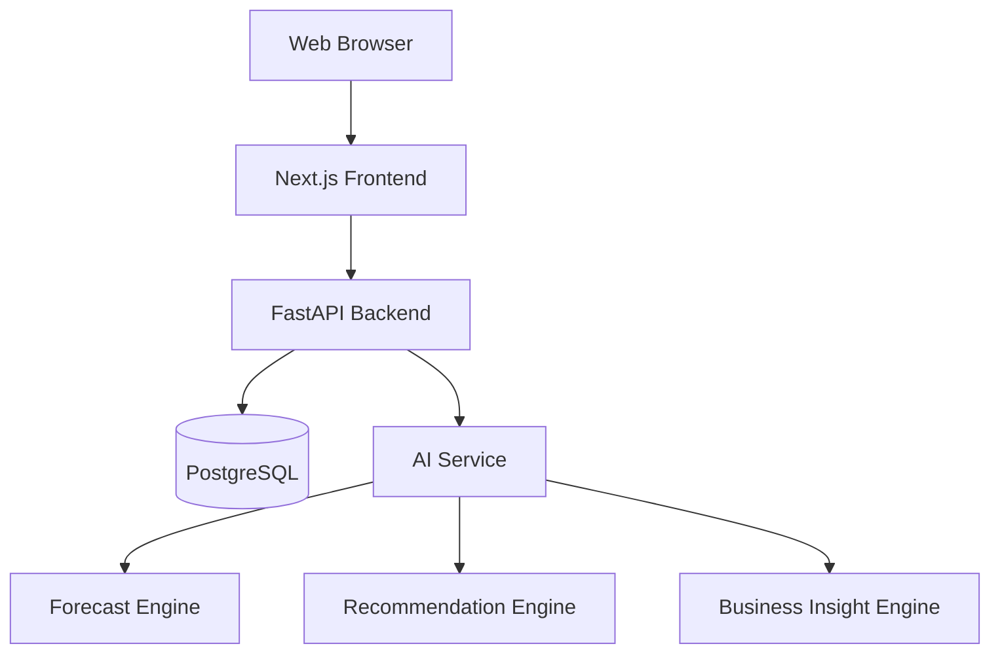

# Product Requirement Document (PRD)

# StockSense AI
**AI-Powered Decision Intelligence Platform for Restaurants**

Version: 1.0  
Author: Albert Christian

---

# 1. Executive Summary

## Background
StockSense AI adalah platform berbasis web yang membantu restoran dan kafe mengelola inventori sekaligus mengambil keputusan bisnis melalui dashboard analitik dan Artificial Intelligence.

Masalah yang ingin diselesaikan:

- Stockout
- Overstock
- Food waste
- Pembelian tidak efisien
- Tidak mengetahui menu paling menguntungkan
- Sulit memprediksi kebutuhan stok
- Tidak memiliki insight bisnis

## Vision
Menjadi platform Decision Intelligence terbaik bagi bisnis kuliner berbasis data dan AI.

## Mission
- Mengurangi food waste
- Mengoptimalkan pembelian
- Meningkatkan profit
- Memberikan insight bisnis secara real-time

---

# 2. Product Goals

## Business Goals

| Goal | Target |
|------|--------|
| Pengurangan Waste | 20% |
| Pengurangan Stockout | 30% |
| Pengurangan Overstock | 25% |
| Akurasi Forecast | MAPE < 15% |

## Success Metrics

- Dashboard < 2 detik
- AI Recommendation tersedia real-time
- Forecast dapat dijalankan kapan saja
- Seluruh transaksi tercatat dalam audit log

---

# 3. Target Users

## Owner
Melihat KPI, profit, revenue, AI insight.

## Restaurant Manager
Monitoring operasional.

## Purchasing Staff
Purchase Order dan supplier.

## Warehouse Staff
Stock opname, stok masuk dan keluar.

## Kitchen Staff
Mengurangi stok berdasarkan recipe.

---

# 4. Product Scope

## Authentication
- Login
- Logout
- Forgot Password
- Role Based Access Control (RBAC)

## Dashboard
- Revenue
- Profit
- Food Cost
- Inventory Value
- Low Stock
- Waste
- Purchase Trend
- Sales Trend

## Inventory
- Master Item
- Category
- Unit
- Supplier
- Batch
- Expired Date
- Barcode
- Stock In
- Stock Out
- Stock Opname
- Reorder Point

## Purchase
- Purchase Request
- Purchase Order
- Receive Goods
- Purchase History

## Recipe
- CRUD Recipe
- Auto Stock Deduction
- Recipe Cost

## Waste
- Expired
- Damaged
- Spillage
- Wrong Production

## Supplier
- Lead Time
- Rating
- Price History
- Delivery Performance

---

# 5. AI Modules

## AI-1 Demand Forecast
Input:
- Historical Sales
- Day
- Month
- Holiday
- Promotion
- Weather

Output:
- Prediksi penjualan harian

Model:
- GRU (v1)
- Prophet (opsional)

## AI-2 Inventory Forecast
Prediksi kapan stok akan habis.

## AI-3 Purchase Recommendation
Menentukan:
- Barang
- Jumlah
- Waktu pembelian

## AI-4 Food Waste Prediction
Prediksi risiko waste berdasarkan histori.

## AI-5 Business Insight AI
Contoh:

> Profit turun 8% karena Food Cost meningkat. Pertimbangkan menaikkan harga menu atau mengganti supplier.

## AI-6 Supplier Recommendation
Memilih supplier berdasarkan:
- Harga
- Lead Time
- Rating
- Kualitas

---

# 6. Functional Requirements

## Authentication
- Login
- Logout
- Reset Password
- Manage User
- Manage Role

## Inventory
- CRUD Item
- CRUD Category
- CRUD Unit
- CRUD Supplier
- Stock In
- Stock Out
- Stock Opname
- Batch Tracking
- Expired Tracking
- Reorder Point

## Purchase
- Create PR
- Create PO
- Receive Goods
- Purchase History

## Dashboard
- KPI
- Charts
- Filters
- Export PDF
- Export Excel

## AI
- Forecast Demand
- Inventory Forecast
- Recommendation Engine
- Business Insight

---

# 7. Non Functional Requirements

- Responsive Design
- REST API
- JWT Authentication
- Audit Trail
- Docker Ready
- CI/CD
- Logging
- Backup Database
- PostgreSQL
- Modular Architecture

---

# 8. Technology Stack

## Frontend
- Next.js
- TypeScript
- Tailwind CSS
- shadcn/ui
- TanStack Query
- Zustand
- Recharts

## Backend
- FastAPI
- SQLAlchemy
- Alembic

## AI
- TensorFlow
- Scikit-learn
- GRU

## Database
- PostgreSQL

## Deployment
- Docker
- GitHub Actions
- Vercel
- Railway

---

# 9. System Architecture

---

# 10. Roadmap

## Version 1
- Authentication
- Inventory
- Dashboard
- Purchase
- Supplier
- Recipe

## Version 2
- AI Forecast
- Purchase Recommendation
- Waste Prediction

## Version 3
- Mobile App (PWA)
- Barcode Scanner
- QR Scanner

## Version 4
- Multi Branch
- Multi Warehouse
- Accounting Integration

## Version 5
- GenAI Chat Assistant
- IoT Integration
- Dynamic Pricing
- Computer Vision

---

# 11. Future Enhancements

- Multi-language
- Notification Center
- WhatsApp Reminder
- Email Automation
- AI Chat
- Predictive Maintenance
- Supplier Portal

---

# 12. Conclusion

StockSense AI dirancang sebagai platform Decision Intelligence yang menggabungkan inventori, analitik, dan AI dalam satu ekosistem untuk membantu restoran mengambil keputusan berbasis data.
